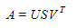

# Dimensional Reduction

## SVD

The Singular Value Decomposition (SVD), a method from linear algebra that has been generally used as a 
dimensionality reduction technique in machine learning. SVD is a matrix factorisation technique, which reduces the 
number of features of a dataset by reducing the space dimension from N-dimension to K-dimension (where K<N). 

In the context of the recommender system, the SVD is used as a collaborative filtering technique. 
It uses a matrix structure where each row represents a user, and each column represents an item. 
The elements of this matrix are the ratings that are given to items by users.

The factorisation of this matrix is done by the singular value decomposition. It finds factors of matrices from the 
factorisation of a high-level (user-item-rating) matrix. The singular value decomposition is a method of decomposing
a matrix into three other matrices as given below:



Where A is a `m x n` utility matrix, U is a `m x r` orthogonal left singular matrix, which represents the relationship 
between users and latent factors, S is a r x r diagonal matrix, which describes the strength of each latent factor 
and V is a r x n diagonal right singular matrix, which indicates the similarity between items and latent factors. 
The latent factors here are the characteristics of the items, for example, the genre of the music. 
The SVD decreases the dimension of the utility matrix A by extracting its latent factors. It maps each user and each
item into a r-dimensional latent space. This mapping facilitates a clear representation of relationships between
users and items. 

## NMF

## LDA
Reference for Topic Modeling with  Latent Dirichlet Allocation

[N x V] = [N x k] [k x V]

- α — Distribution related parameter that governs what the distribution of topics is for all the documents in the corpus looks like
- θ(i,j);  the topic distribution for documents
  - i th document to containing words belonging to the j th topic
- η — Distribution related parameter that governs what the distribution of words in each topic looks like  
- β(i,j) represents the probability of the i th topic containing the j th word.


- Dirichlet distribution is the multivariate generalisation of the Beta distribution.
  - laRGE VALUES PUSHED THE DISTRIBUTION TOWARDS THE  MIDDLES OTHERWISE TO THE CORNER
  

**Statistical Refresher**
- [Generative and Discriminative model](https://medium.com/@mlengineer/generative-and-discriminative-models-af5637a66a3)
- [Joint Probability vs Conditional Probability](https://medium.com/@mlengineer/joint-probability-vs-conditional-probability-fa2d47d95c4a)
- https://www.statisticshowto.com/likelihood-function/
- KL Divergence
    - https://www.countbayesie.com/blog/2017/5/9/kullback-leibler-divergence-explained
    - https://machinelearningmastery.com/divergence-between-probability-distributions/  
- [Beta Distribution](https://towardsdatascience.com/beta-distribution-intuition-examples-and-derivation-cf00f4db57af)
    - https://www.youtube.com/watch?v=CEVELIz4WXM
- https://en.wikipedia.org/wiki/Dirichlet_distribution
- https://towardsdatascience.com/dirichlet-distribution-a82ab942a879

**Blogs explaining LDA Maths**
- https://towardsdatascience.com/light-on-math-machine-learning-intuitive-guide-to-latent-dirichlet-allocation-437c81220158
- https://towardsdatascience.com/latent-dirichlet-allocation-lda-9d1cd064ffa2
- https://medium.com/@lettier/how-does-lda-work-ill-explain-using-emoji-108abf40fa7d
- [how to control density of topics / doc and words / topic ?](https://datascience.stackexchange.com/questions/199/what-does-the-alpha-and-beta-hyperparameters-contribute-to-in-latent-dirichlet-a)

**Evaluation Metric**
- https://highdemandskills.com/topic-model-evaluation/
- https://towardsdatascience.com/perplexity-in-language-models-87a196019a94
- https://planspace.org/2013/09/23/perplexity-what-it-is-and-what-yours-is/
- https://stats.stackexchange.com/questions/10302/what-is-perplexity
- https://svn.aksw.org/papers/2015/WSDM_Topic_Evaluation/public.pdf
- https://www.statlect.com/glossary/log-likelihood
- https://labs.imaginea.com/how-to-measure-topic-coherence/
- 
**Examples**
- [Scala Example](https://databricks-prod-cloudfront.cloud.databricks.com/public/4027ec902e239c93eaaa8714f173bcfc/3741049972324885/3783546674231782/4413065072037724/latest.html)
- https://towardsdatascience.com/unsupervised-nlp-topic-models-as-a-supervised-learning-input-cf8ee9e5cf28


## Environment Setup
```
#Download and extract Spark binaries to /opt/softwares/spark-2.4.7-bin-hadoop2.7/
sudo apt install openjdk-8-jdk


export JAVA_HOME=/usr/lib/jvm/java-8-openjdk-amd64/
export SPARK_HOME=/opt/softwares/spark-2.4.7-bin-hadoop2.7/
export PATH=$SPARK_HOME/bin:$PATH
export PYSPARK_PYTHON=/opt/envs/ai4e/bin/python
export PYSPARK_DRIVER_PYTHON=/opt/envs/ai4e/bin/python
```
Spark UI: [http://localhost:8080](http://localhost:8080)   
Spark Master URL : spark://IMCHLT276:7077

Shell 1
```
cd /opt/softwares/spark-2.4.7-bin-hadoop2.7/
sbin/start-all.sh # or
sbin/stop-all.sh
```

Shell 2
```
cd /path/to/project
conda activate ${YOUR_ENV}
jupyter-lab
```

My machine has following configuration...
- 6 cores with 12vCores
- 32GB RAM

Spark Standalone server:
